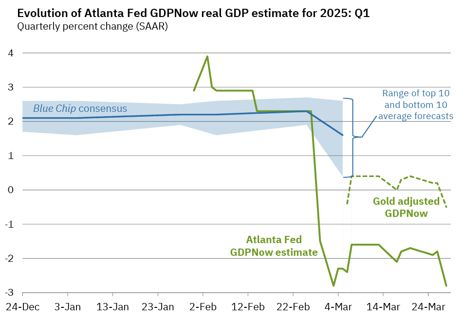
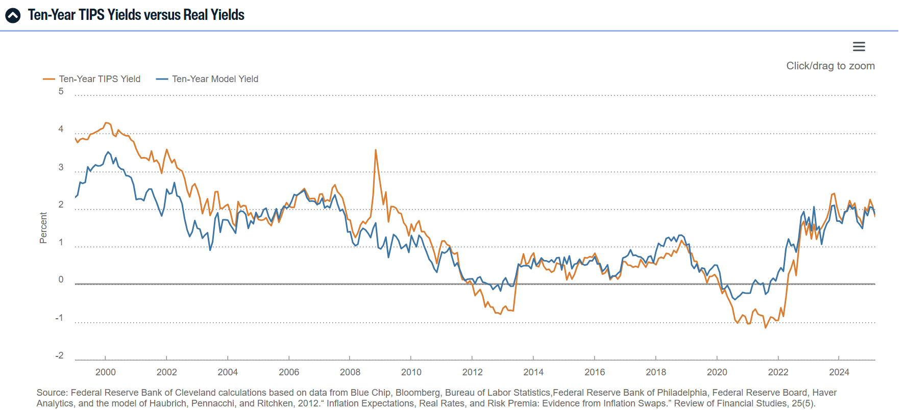

It's a genuine question. And I am definitely not talking about the [Severance frenzie](https://trends.google.com/trends/explore?date=2024-01-01%202025-03-27&q=severance&hl=fr)... although I am happy (i) to see Ireland featured heavily in these statistics and (ii) a full TV serie with [Cassette Futurism and Nimrod chairs](https://www.housebeautiful.com/lifestyle/entertainment/a64211985/severance-season-2-set-decor/). I will talk in a minute about econ don't you worry, but let me say that I haven't found a good stack / podcast / article on the philosophical meaning of Art in the corporate environment. I do think that there is more to this than the factual comparisons with the soviet style, Caspar Friedrich or other simple interpretations around propaganda.

## Stagflation is Great Again

So you perhaps do remember your econ102 class that was talking about **the Phillips curve**, right? Classic structural trade-off between inflation and unemployment. Since then, of course, a lot has been said. Some said it has [flattened](https://www.stlouisfed.org/open-vault/2020/january/what-is-phillips-curve-why-flattened), others that it should be looked at from a [local perspective](https://drive.google.com/file/d/1PT6GKEWFZVmJm0kVIVrzZs66I_K6C2ym/view) or also related [challenges to monetary policy](https://www.aeaweb.org/articles?id=10.1257/aer.p20161003). Now, one way to "break" the Phillips curve and have a situation of both inflation and sluggish labour market (i.e. a *Stagflation*) is to have imported inflation linked to raw materials. The two major oil shocks in 74 and 79 have been the best illustration of this phenomenon: in 1975, in OECD countries, unemployment hits 5,5% and inflation is at 10%. P. Volcker did his duty and fought inflation with his (very) aggressive tightening of monetary policy.

My point is rather that we seem to be bound to a similar situation today for a different reason! You may recall from the previous post that US tariffs **will** lead to inflation. For all products but also -- and more similarly to what we just said -- because input prices will be higher (e.g on Pharma). But at the same time the story is this one: we are defunding universities (lowering aggregate productivity; lower human capital), implementing stricter migration policies (lowering the L factor in our F(K,L) function right) and firing the administration, which is a [sizable provider of services and consumption](https://www.brookings.edu/articles/is-government-too-big-reflections-on-the-size-and-composition-of-todays-federal-government/). You know what would be "funny" as a side project? Looking at the local Washington D.C GDP impact through the lenses of nowcasting model (see below), I'm sure the graph would be fun to see! Mechanically, I don't see how we can have anything else but inflation and a sluggish economy.

We don't have the crystal ball but we do have Nowcasting models. For those of you out there not at the GeekFrontier of GDP forecasting (nobody blames you for it) let me just give you here the link to the [incredible paper](https://www.ecb.europa.eu/pub/pdf/scpwps/ecb.wp3004~3ce9d0d8ca.en.pdf?94efa94a70954b38df981f0a988047bb) by Linzenich and Meunier who are explaining how to use these models of early estimates. You can play around they have [shared the code](https://github.com/baptiste-meunier/Nowcasting_toolbox) with us! And it would give probably a moment of sheer joy for my students who now should be able to understand what a RMSE is (I hope?). The Fed of Atlanta has done the job for us and.. it does look grim:

*Figure 1: Federal Reserve Bank of Atlanta GDP Growth Nowcast*

*Figure 2: 10-year Inflation Expectations based on TIPS spread*

And on the [inflation end](https://www.clevelandfed.org/indicators-and-data/inflation-expectations) we do see an uptick in the 10yr model yield (spread between the TIPS and the US 10yr). Regular Treasury bonds include both real returns and an inflation premium to compensate investors for expected future inflation, while TIPS adjust their principal for actual inflation, thus eliminating this premium from their yield; the difference between these two yields, called the "breakeven inflation rate," therefore represents what the market expects average inflation to be over the next decade, providing a straightforward, continuously updated market estimate. I will, at some point, somehow, somewhere, write something on the yield curve. But not now.

The conclusion of both graph from my window is: winter (or stagflation) is coming.

## Mar-a-lago Accord

But even if you find me a model which would gives a rationale to a trade-off between stagflation and political reelection, in this case coherence would at least command that you don't defend the role of the dollar as an international currency but it being sufficiently weak to support your exports. Why?

Well for one thing the maths don't add up. Triffin kinda laid the argument in the 1960s: it was the context of the Bretton Woods agreement but the idea was that the demand for dollars as a reserve asset could only be supplied by persistent US current account deficits, which in turn meant that the dollar was persistently overvalued relative to the requirements of equilibrium in the balance of payments (Krugman has a [gentle post](https://paulkrugman.substack.com/p/a-balance-of-payments-primer-part) guiding you step by step on how this is constructed on his substack). Over time, the confidence eroded and we ended up with Nixon suspending gold convertivility. Many people by the way forget that Nixon also imposed a 10% tariffs on import and a 90 day wage price freeze. Anna Wong [made](https://x.com/AnnaEconomist/status/1905731342928859316) an interesting comparison with the Smithsonian agreement but I leave it to those who are interested. I'll cover the 1985 Plaza Accord.

International monetary arrangements following the 1971 suspension of dollar convertibility proved inadequate as the dollar began appreciating again in the early 1980s, driven by higher US interest rates implemented to counter inflation resulting from the oil shocks. This context set the stage for the Plaza Accord, concluded in New York on September 22, 1985 between Germany, the United States, France, Japan, and the United Kingdom, which orchestrated a coordinated devaluation of the dollar through joint central bank intervention, representing a shift in the American attitude of "benign neglect" toward their currency's external value. In response to the continued dollar decline that followed, the Louvre Accord of February 22, 1987 complemented the arrangement with a stabilization perspective, secretly introducing fluctuation bands.

With this in mind we are back to the new idea: a [Mar-a-Lago Accord](https://www.hudsonbaycapital.com/documents/FG/hudsonbay/research/638199_A_Users_Guide_to_Restructuring_the_Global_Trading_System.pdf). Stephen Miran, chair of the Council of Economic Advisers, outlined in this note what he thinks could be a new international agreement to deliver a stronger US manufacturing sector, in combination with tariffs and a weak dollar that is still an international reserve (sic). Focusing on the "dominant-but-weaker" side of things, how could that work? The proposal suggests that the U.S. would consider reducing tariffs if a foreign country agreed to sell its U.S. government bonds from central bank reserves in exchange for its own currency. But in order to avoid a yield crisis on the T-bill market (and a US debt crisis) central banks would also agree as they sell current holdings to swap into smaller dollar amounts of ultra-long Treasury bonds (say 50- or 100-year bonds with zero or low coupons).

This may seem complex so let me summarize this: as a trade partner of the US, you would avoid higher tariffs by agreeing to "term out" your existing Treasury holdings. This means you would sell your current shorter-term US Treasury bonds and use those funds to purchase special ultra-long-term bonds (like 100-year bonds). You would sell some of your dollar reserves, which would strengthen your currency relative to the dollar. The dollar would remain the world's primary reserve currency, but with a modified arrangement. Instead of holding large quantities of short-term Treasury securities that can be quickly liquidated, you would hold fewer but longer-dated US bonds.

Have we squared the circle? Well. As a trade partner it means that you are willingly lowering the return of your portfolio. Not going to happen. But it is definitely Geo-financial coercion, something we have done to others... and that the US is now doing to us?

## Cultural Corner

Lately it's been a lot of Severance (you guessed) and of course *Silo*. Both *Silo* and *Fallout* explore a world where truth is a carefully managed resource. In *Fallout*, the wasteland feels open and chaotic, but the vaults tell a different story---experiments disguised as salvation, with dwellers kept in the dark for "the greater good." *Silo* takes a more Orwellian approach, where even questioning the official narrative is a crime. Hannah Arendt warned that totalitarian control isn't just about oppression---it's about reshaping reality so people can't imagine alternatives. Whether through secrecy or selective revelation, both worlds remind us: the greatest power isn't just having information---it's deciding who gets to know it.

In terms of reading, *Notre Dame de Paris* has not given be the goosebumps I expected but it was still a fine reading. I also finished another Zola (I know). And I am deep into Tolkien now...

Just going back on these few incredible songs: ["Hip Hop"](https://www.youtube.com/watch?v=BFwNosyLFtM) by Joell Ortiz; ["Feel it still"](https://www.youtube.com/watch?v=F09POwrBn-M) by Portugal. The Man and ["Gabriel"](https://soundcloud.com/landsend-records/gabriel?in=miroslav-wow/sets/extra)... merci Antoine!

Finally I'd like to leave you all on this thought: ["Have humans passed peak brain power ?"](https://www.ft.com/content/a8016c64-63b7-458b-a371-e0e1c54a13fc) I made up my mind. 