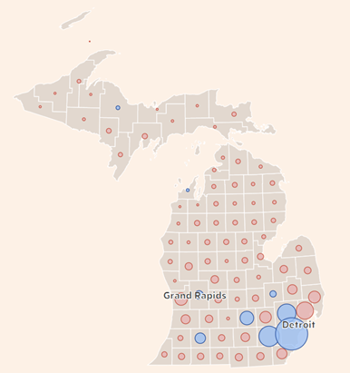
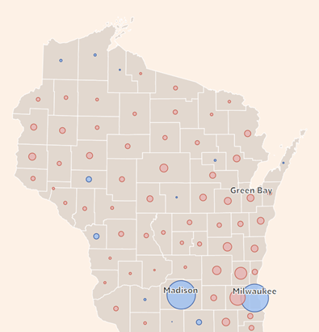



---
title: '[#1 | New Github journey -- US Election (1/X)]'
summary: 'Analyzing the 2024 US election results and implications for political realignment, with thoughts on recent cultural recommendations.'
date: 2024-11-14
image:
  caption: 'Photo by eberhard 🖐 grossgasteiger on Unsplash'
authors:
  - admin
tags:
  - Politics 
  - US Elections
  - Analysis
---

I decided to pick up again on some of my old habits. This time, though, it will have a twist though: I'll share here some of my most recent work, readings, music or films I have enjoyed. Perhaps this will be of interest to some. Mostly, this will be of help to me for organizing thoughts and keeping track of my journey.

## Election Results

**First, I want to come back on the outcome of US elections, which have been less close than initially anticipated**. The GOP won the Presidential race (Trump 50.38% (74.8M) votes vs. Kamala 47.96% (71.2M)); the House of Rep (214 (+1) vs. 204 (-1)) and the Senate (53 (+4) vs. 46 (-4)). Battlegrounds (AZ,NV, MI, WI, PA, GA, NC, NE) were all won by Trump. Still, 4 states are won by 100,000 votes or less (MI, NV, WI, MI) and all of them by <1%. Looking at a more granular level: each map shows the usual fracture around city / rural areas.

## Electoral Shifts

**Stunning to see that Trump increased his vote share virtually in every State (apart from Washington) and every electoral group**. The push was stronger for States he previously won in the 2020 election, particularly Florida and Texas. But this does not necessarily suggest polarization because we see the same push in Democratic states: California (or New Jersey) goes from -30% (-16%) to -17% (-5%) ! I really like the map which shows the gain through arrows from a geographical perspective. Looking at the electorate, the same message goes on. The Republican candidate gained support among Asian, Black, Hispanic and White. GOP has now a 40% margin for White non-college men. Kamala Harris only increased her vote share among the over-65s and with white college-educated women.

For those of you who, like me, are afficionados of [Concordance des temps](https://www.radiofrance.fr/franceculture/podcasts/concordance-des-temps): Grover Cleveland was actually the first president to set precedent of nonconsecutive presidential terms. He's the one who inaugurated our beloved Statue of Liberty.

## Key Issues

**Looking at what mattered, exit polls were outlining three key topics (immigration, inflation and abortion) but ultimately it seems that the economy was the most decisive one**. It sure seems that we were talking a lot about *immigration* (14% of the 300M US population; out of which 50% are naturalized citizens). What the campaign has showed, as rightfully highlighted by the [Economist](https://www.economist.com/united-states/2024/10/08/donald-trump-is-preparing-an-assault-on-americas-immigration-system), is that that divide between the two candidates on migration is stark, but has narrowed (32% of Dems support building a border wall !). But perhaps now they will [stop eating the cats](https://www.youtube.com/watch?v=3BrCvZmSnKA) through sheer signalling effect. [Abortion](https://www.nytimes.com/interactive/2024/11/06/us/elections/abortion-ballot-results-laws-election.html?smtyp=cur&smid=tw-nytimes) on the other hand has been completely pushed to the side, for reasons that escape me (I admit). Last but not least, inflation. This is probably the biggest explanation for the US results: under Trump's first mandate inflation gravitated roughly at 2% but surge under Biden's years on the backdrop of Covid and the Ukrainian crisis. Tough to debate the economic outcomes (transition effects, macro-trends, labor participation). S. Stantcheva has done some amazing job at analyzing people's [understanding](https://www.sciencedirect.com/science/article/pii/S0304393224001053) (and [hate](https://x.com/S_Stantcheva/status/1774800430792339835)) of inflation: in a nutshell, people tend to explain wage gains by their own efforts, while price inflation -- and we all see that change daily in the supermarket -- to policy and government. Again, no polarization along party lines on that front. One last thought on this: I have seen multiple discussions on the [Enns et. al. paper](https://t.co/VJvX57TGvb) that gave apparently the closest prediction of the election with a model based on the Philly Fed Coincident Index (composite of labor, real income, manufacturing, etc.). I am not entirely sure to understand everything they do and say, but it reinforces me in thinking that the result were strongly driven by economic factors rather than ideological biases.

## Political Realignment

**So now a few ideas on '*what does that mean for the system ?*'** First, I recall talking about *political realignment* with my very good friend Angie some 7 years ago. In the 1950s, V.O. Key s conceptualized the idea that recurringly in history we see event blowing existing electoral coalition supporting political parties, often precipitated by a critical election that reveals new voter concerns and priorities, leading to enduring changes in party loyalty and voting patterns. Classic example is of course Roosevelt. The 1932 election marked a major realignment as working-class voters, urban dwellers, African Americans, and Southern whites formed a new Democratic coalition around the New Deal. Realignment has since then been well investigated. I think the 1M dollar question here is: why do popular classes vote against (seemingly) political parties that go against their interests ? A philosophical answer can be found in *Retour à Reims*. Political economy research provides many different answers. These are tied to the importance attached to cultural beliefs (Gennaoili et. al, [2021](https://academic.oup.com/qje/article/136/4/2371/6368349)), media and misinformation (DellaVigna & Kaplan, [2007](https://academic.oup.com/qje/article/122/3/1187/1879517)) or trade exposures (Autor et al.,[2020](https://www.aeaweb.org/articles?id=10.1257/aer.20170011)). [Here](https://nicolaslonguetmarx.github.io/PartyLines_NLM.pdf) is a cool recent paper by Nicolas Longuet-Marx (it's his JMP actually) which has concrete policy implications I feel. On every topic, it is interesting to distinguish cultural ideology from economic implications. How to turn this into a political strategy? I'll leave it to smarter brains but definitely, the environmental part of his paper will be worth a read. Also on this topic: for someone going into the rabbit hole, I'd say the distinction between education and wealth *[à la Piketty](https://ideas.repec.org/p/hal/psewpa/hal-02878211.html)* (or is that Bourdieu ?) is important to note. 

## Cultural Corner

**What to watch ?** For my European friends, Arte has uploaded ***Paths to Glory*** and there's never a dull moment when a Kubrick will not fill the void. Made me think a lot about Agamben's little Archaeology of leadership and the fact that every order was a non-apophantic discourse. Also enjoyed ***All of Us Strangers***... And I'm not saying that because both protagonists are Irish but because the photography is simply incredible!

**What to read ?** Trying to finish up *Splendeurs et misères des Courtisanes*. I think I'll pause my Balzac streak after that. Too much XIXth century is getting to me. I will pick up some econ readings.

**What to listen to?** ["How does it feel"](https://open.spotify.com/track/58Fn57zPev74zPB3G3Nqr3?si=23a83f728a804774) (Bill Laurance, Michael League) is on repeat mode. When not Stereophonics and ["Maybe Tomorrow"](https://open.spotify.com/track/6SXy02aTZU3ysoGUixYCz0?si=050735637bde4c23) takes the lead.
